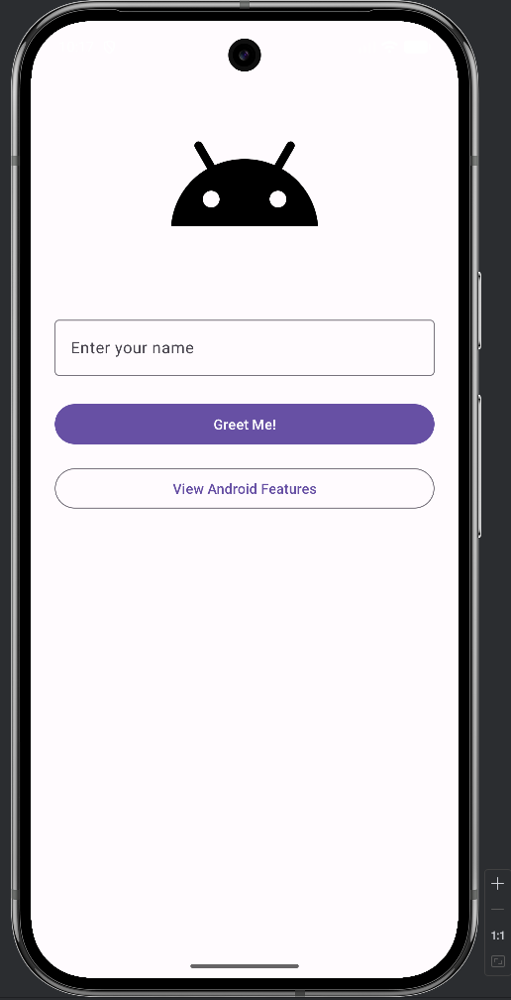
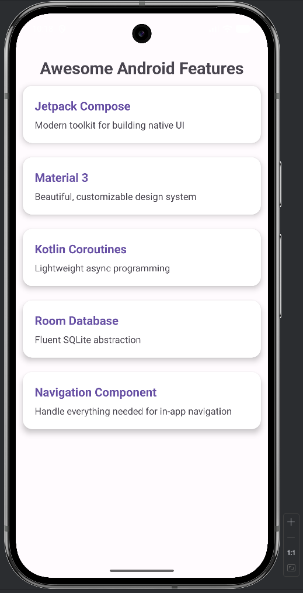
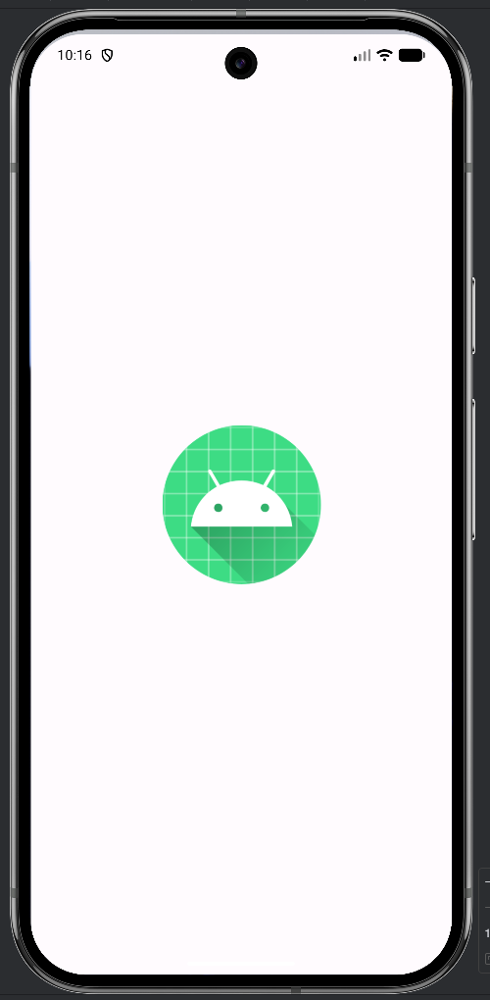
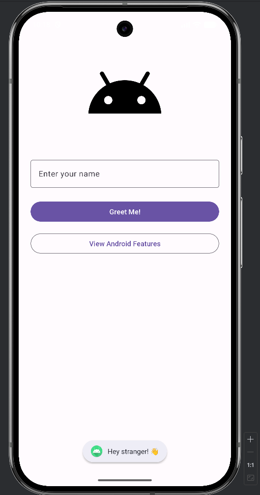
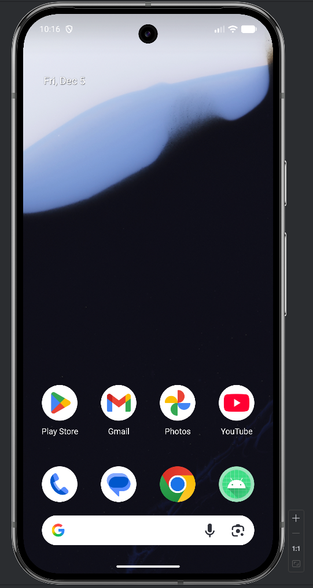
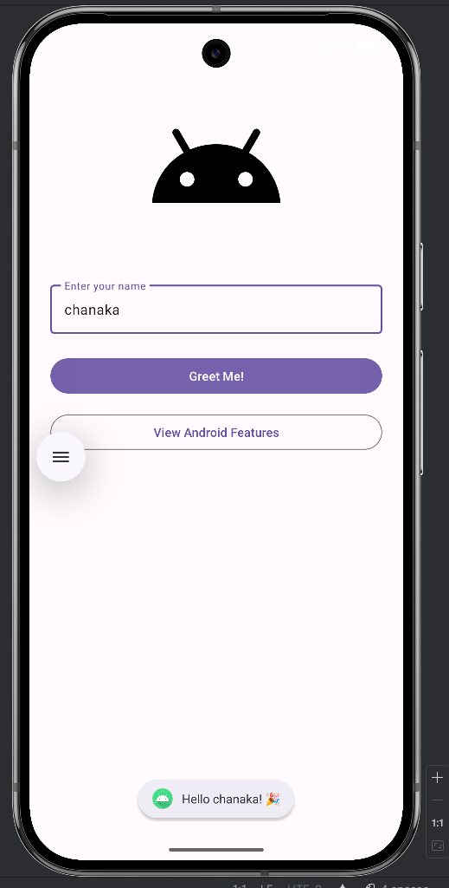

# Mobile Application Development - Assignment 01

## Screenshots

### First Activity


### Second Activity


### Splash Screen


### First Toast Message


### Launching Icon


### EditText


## Features

### 1. **Main Activity**:
   - **Android logo**: Displayed using an `ImageView`.
   - **EditText**: User can enter their name in a `TextInputEditText`.
   - **Greeting Toast**: Personalized greeting displayed as a Toast message when the "Greet Me!" button is clicked.
   - **Navigation**: A button navigates to the second activity when clicked.

### 2. **Second Activity**:
   - **RecyclerView**: Displays a list of Android features such as **Jetpack Compose**, **Material 3**, **Kotlin Coroutines**, **Room Database**, and **Navigation Component** in a `RecyclerView`.
   - **Features**:
     - Each feature has a **title** and **description**.
     - The data is displayed using a custom `FeatureAdapter` for the `RecyclerView`.

## Used Technologies
- Kotlin
- Android Studio

## Screenshots of Features

### 1. **Main Activity**
   The first screen where users can input their name, get a greeting via a Toast, and navigate to the second activity.
   
   

### 2. **Second Activity**
   Displays a list of Android features in a `RecyclerView`, showcasing various technologies in Android development.
   
   

### 3. **Splash Screen**
   The splash screen that is shown briefly when the app is launched.

   

### 4. **Toast Message**
   The greeting displayed in a Toast when the user clicks the "Greet Me!" button without entering a name.

   

### 5. **App Icon**
   The launcher icon displayed on the device home screen.

   

### 6. **EditText Toast**
  The greeting displayed in a Toast when the user clicks the "Greet Me!" button with a name entered.

   

## Getting Started

To get a local copy of this project up and running:

1. Clone the repository:
   ```sh
   git clone https://github.com/yourusername/HelloAndroidUI.git
